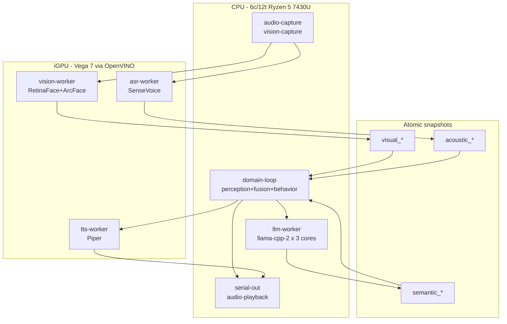
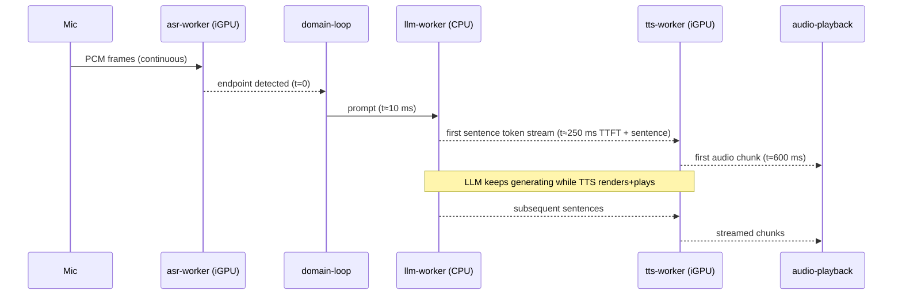

# Scheduling

> **Status:** draft, design phase. Lives at repo root while it's being shaped; will graduate to `docs/scheduling.md` once stabilized. See [README.md](README.md) for project overview.

Goes deeper than [docs/architecture.md](docs/architecture.md) §Threading. Anchored to the hardware envelope in [docs/hardware.md](docs/hardware.md). The job of this doc is to make sure the pipeline runs on a Ryzen 5 7430U laptop without sustained thermal throttling.

---

## 1. Hardware envelope

Restated from [docs/hardware.md](docs/hardware.md) and [docs/constraints.md](docs/constraints.md):

| Resource | Spec | Scheduling implication |
|---|---|---|
| CPU | Ryzen 5 7430U, 6c/12t Zen 3 mobile | Low sustained TDP (~15–25 W configurable). Throttles under prolonged 100% load. Plan for duty-cycled bursts, not steady-state saturation. |
| RAM | 16 GB DDR4 | Shared with iGPU. Every byte the iGPU uses is a byte the LLM KV cache can't. |
| iGPU | RX Vega 7 (integrated) | No dedicated VRAM; shares CPU DRAM channels. Memory bandwidth contention is real. |
| Storage | 512 GB SSD | Model files load once at boot; not on hot path. |

Constraints this drives (from [docs/constraints.md](docs/constraints.md)):
- End-to-end ≤ 800 ms (user-speech-end → robot-speech-start).
- Vision @ 15 FPS, acoustic @ 30 FPS, perception @ 10 Hz, fusion @ 20 Hz.
- Hysteresis ≥ 300 ms before motor change.

> The headline risk: LLM (CPU-bound) + ONNX models (iGPU + DRAM bandwidth) + audio I/O running continuously will pin the SoC and trigger thermal throttling, which then *blows the latency budget* — a self-reinforcing failure mode.

---

## 2. Compute split (CPU vs iGPU)

Rationale from [docs/decisions.md](docs/decisions.md) ADR-002 / ADR-003: keep the CPU free for the LLM by pushing every other model to the iGPU via OpenVINO.

| Stage | Device | Runtime | Notes |
|---|---|---|---|
| RetinaFace (face detect) | iGPU | `ort` + OpenVINO | 15 FPS gated by vision tick |
| ArcFace (identity) | iGPU | `ort` + OpenVINO | Run only on detect, not every frame — TBD cadence |
| Facial-landmark metrics | CPU | pure Rust math on landmark tensor | Cheap; no model |
| SenseVoice (ASR + emotion + AED) | iGPU | `sherpa-onnx` | 30 FPS sliding window |
| Piper TTS | iGPU | `sherpa-onnx` | Bursts during robot turn only |
| Qwen 2.5 3B Q4_K_M | **CPU** | `llama-cpp-2` | Single biggest CPU consumer |
| Audio capture (16 kHz) | CPU | `cpal` | Lightweight; one thread |
| Audio playback (TTS out) | CPU | `cpal` | Lightweight; one thread |
| Perception aggregator | CPU | pure Rust | 10 Hz, no I/O |
| Fusion | CPU | pure Rust | 20 Hz, no I/O |
| Behavior + ports | CPU | pure Rust | Drives Arduino + TTS |
| Arduino serial bridge | CPU | `serialport` | Negligible load |

Two key invariants:
- **The LLM never shares the iGPU.** OpenVINO context stays exclusive to vision/hearing.
- **Vision and TTS never run simultaneously at peak.** Both hit the iGPU; serialize via the pipeline scheduler in §4.

---

## 3. Thread / process topology

### Recommendation: single binary, multi-threaded

Multi-process buys process isolation but costs IPC overhead and complicates the atomic-snapshot model in [docs/architecture.md](docs/architecture.md) §Threading. Single binary with carefully scoped threads is cheaper and matches the existing crate split (`uncanny-core` + `uncanny-embedded` + `uncanny-godot`).

**Open question (§9):** revisit if the LLM crashes need to be isolated from the rest.

### Thread layout

| Thread | Pinning hint | Priority | Job |
|---|---|---|---|
| `audio-capture` | core 0 | nice -5 | `cpal` callback, push to ring buffer |
| `vision-capture` | core 0 | nice 0 | webcam frame grab, downscale to model input |
| `asr-worker` | iGPU + core 1 | normal | feeds SenseVoice, writes `acoustic_*` slot |
| `vision-worker` | iGPU + core 2 | normal | runs RetinaFace + landmark math, writes `visual_*` slot |
| `llm-worker` | cores 3–5 (3 cores) | normal | `llama-cpp-2` thread pool. Burst-only. |
| `domain-loop` | core 1 (shared) | normal | reads atomic slots, runs perception → fusion → behavior @ 20 Hz |
| `tts-worker` | iGPU + core 2 (shared with vision) | normal | Piper render; gated by vision idle |
| `serial-out` | any | low | Arduino writes, batched |
| `audio-playback` | any | nice -5 | drains TTS buffer to speakers |

Notes:
- Pinning is a *hint* — start with `taskset`/`sched_setaffinity` only if measurements show the kernel scheduler isn't doing the right thing. Default = let the scheduler decide, document only.
- Reserve **one logical core for the OS** (do not pin anything to core 0 SMT siblings if possible). The 7430U is the user's daily driver too.
- LLM gets 3 physical cores (`n_threads = 3` in `llama-cpp-2`). Empirically that's the sweet spot for Zen 3 mobile before memory bandwidth saturates; validate via the [benchmark CLI](docs/benchmark.md).

### Topology diagram



---

## 4. Pipeline scheduling (conversational hot path)

The 800 ms budget from [docs/constraints.md](docs/constraints.md) is what makes or breaks felt latency. Stages must overlap, not stack.

### Sequential (naive) — does not fit

```
| ASR finalize | LLM generate full response | Piper TTS render | playback |
   ~150 ms          ~1500 ms (3B Q4)            ~400 ms          ~50 ms
```

Total ≈ 2.1 s. Blows the budget.

### Streaming / overlapped — target

Stream tokens out of `llama-cpp-2` and start Piper as soon as the first sentence boundary is reached. TTS begins playing while LLM is still generating.



Per-stage budget (TBD, validate with [benchmark CLI](docs/benchmark.md)):

| Stage | Target | Hard cap |
|---|---|---|
| ASR endpoint → finalize | 100 ms | 150 ms |
| Prompt build + KV warm | 30 ms | 50 ms |
| LLM TTFT | 200 ms | 300 ms |
| First sentence (~15 tokens) | 150 ms | 250 ms |
| Piper render first chunk | 250 ms | 350 ms |
| Audio buffer prefill | 50 ms | 80 ms |
| **Total to first audio** | **~780 ms** | — |

**Critical co-scheduling rule:** while TTS is rendering on the iGPU, vision drops to 5 FPS (or pauses entirely). The robot is "speaking" — it doesn't need to micro-track the listener's face. Vision resumes full 15 FPS when TTS finishes.

---

## 5. Memory budget

Hard ceiling: **16 GB total**, minus OS + dev tools.

| Bucket | Estimate | Notes |
|---|---|---|
| OS + desktop + browser headroom | 4.0 GB | Linux + whatever the user has open. Treat as non-negotiable. |
| Qwen 2.5 3B Q4_K_M weights | 2.0 GB | Mmapped by `llama-cpp-2`. |
| LLM KV cache | 1.5 GB | Sized for ~4k context @ 3B Q4. Validate. |
| RetinaFace + ArcFace ONNX | 0.5 GB | Includes OpenVINO compiled blobs. |
| SenseVoice ONNX | 0.8 GB | Largest non-LLM model. |
| Piper TTS voice | 0.2 GB | Per loaded voice. |
| Audio sliding window | < 0.1 GB | 16 kHz mono × N seconds. |
| Video frame ring | 0.2 GB | 1080p downscaled, ~5 frames. |
| Domain heap (Rust) | < 0.1 GB | Atomic slots + small queues. |
| **Subtotal** | **~9.4 GB** | — |
| **Headroom** | **~6.6 GB** | Burst allocations, page cache, model warm-up. |

Open: confirm KV-cache size after picking final context length. The benchmark CLI ([docs/benchmark.md](docs/benchmark.md)) reports memory before/peak/after; use it to validate.

---

## 6. Backpressure & degradation

What happens when a stage misses its tick. Default policy: **drop, don't queue.**

| Failure | Action |
|---|---|
| Vision worker can't keep 15 FPS | Drop oldest frame; emit `visual_confidence -= n` to fusion so weights downshift. |
| ASR worker queue grows | Drop oldest audio chunk; never delay endpointing. |
| Perception aggregator misses 10 Hz tick | Skip the tick. Fusion reads stale snapshot — that's fine, [docs/architecture.md](docs/architecture.md) §Threading already assumes atomic latest-value. |
| Fusion misses 20 Hz tick | Same — skip, behavior reads stale `SocialContext`. |
| User starts speaking mid-LLM-turn | Cancel in-flight `llama-cpp-2` generation, flush TTS queue. See [docs/subsystems/speech.md](docs/subsystems/speech.md) §Queue & Interrupt. |
| LLM TTFT > hard cap | Emit pre-canned filler ("hmm…") via TTS to buy time. TBD policy. |
| Thermal throttle detected (§7) | Reduce vision to 5 FPS, cap LLM to 2 cores, warn in logs. |

---

## 7. Thermal management

The 7430U will throttle if pushed for minutes. Goals: bursty load, idle when idle, observable.

### Duty-cycle rules

- **LLM**: only running while there is an active user turn. No background generation. No "anticipation" inference.
- **Vision**: gated on user-presence. If RetinaFace returns no face for > 2 s, drop tick rate to 1 FPS until a face reappears.
- **ASR**: lower-power voice-activity detector (VAD) gates SenseVoice. Run cheap VAD continuously; only run SenseVoice on speech segments.
- **TTS**: only during robot turn, by definition.

### Power knobs

- Set `cpufreq` governor to `schedutil` (default on modern kernels). Avoid `performance` governor — it disables natural cool-down.
- Optional: `ryzenadj`/`amd-pstate` to cap sustained TDP at ~20 W. Document but don't auto-apply.
- Disable CPU turbo boost during long-running benchmark runs to get repeatable numbers (this is a benchmark-only tweak, not production).

### Observability

Reuse the thermal-sampling code already in the LLM benchmark CLI ([docs/benchmark.md](docs/benchmark.md)) — it samples Linux thermal zones and CPU usage. Wire the same sampler into the runtime as a low-priority background thread (≥ 1 Hz is enough). Surface:

- `cpu_temp_celsius`
- `cpu_freq_mhz` per core
- `mem_used_gb`
- `igpu_busy_pct` (best-effort via `radeontop` or sysfs)

Trigger §6 degradation when `cpu_temp_celsius > 90` for > 5 s.

---

## 8. Concurrency primitives

Aligned with [docs/architecture.md](docs/architecture.md) §Threading ("no locks on the hot path; atomic snapshots only").

| Need | Choice | Why |
|---|---|---|
| "Latest value" inter-thread slot (e.g. `PerceptionPacket`) | `arc_swap::ArcSwap<T>` or triple-buffer | Lock-free reads, single writer. Fits the atomic-snapshot pattern. |
| Command queue (behavior → Arduino, TTS requests) | `crossbeam_channel` bounded | Bounded so backpressure is observable; cheap MPMC. |
| Cancellation tokens (LLM interrupt) | `AtomicBool` polled in `llama-cpp-2` callback | Avoids dropping the worker thread; clean cancel. |
| Async runtime | **None in domain core.** `tokio` only at adapter edges (e.g. serial, network if any) | Domain stays sync + deterministic for Godot replay. |
| Shared mutable state | Avoid. If unavoidable, `parking_lot::Mutex` only outside hot path. | — |

---

## 9. Open questions

Seeded — expand as decisions are made. Promote resolved entries to [docs/decisions.md](docs/decisions.md) as ADRs.

- **Process model:** stay single-binary or split `uncanny-core` into a daemon + thin clients (Godot, future GUI)?
- **Async runtime scope:** none, or `tokio` at the adapter edge only? Affects `cpal`/`serialport` integration.
- **Per-stage latency budget:** §4 numbers are estimates. Open item also tracked in [docs/constraints.md](docs/constraints.md).
- **Core pinning:** pin `llm-worker` to specific cores via `sched_setaffinity`, or trust the kernel? Measure first.
- **LLM thread count:** start at 3, sweep 2–6 with the [benchmark CLI](docs/benchmark.md). Memory bandwidth on dual-channel DDR4 likely caps the useful count.
- **KV cache size:** depends on chosen context length. Affects §5.
- **Vision cadence under TTS:** drop to 5 FPS or pause entirely? Affects §4 co-scheduling rule.
- **Thermal cap value:** 90 °C is a guess. Read the 7430U's actual `tjmax` and back off ~10 °C.
- **Validation harness:** extend the LLM benchmark CLI to a full-pipeline soak test, or build a separate tool? The CLI already has thermal/CPU samplers — reuse > rebuild.
- **Filler-utterance policy:** is "hmm…" acceptable behavior or does it break the uncanny goal? Coordinate with behavior design.

---

## 10. Cross-references

- [docs/architecture.md](docs/architecture.md) — hexagonal layers + the brief threading section this doc extends.
- [docs/hardware.md](docs/hardware.md) — BOM and rationale.
- [docs/constraints.md](docs/constraints.md) — testable targets driving §1, §4.
- [docs/decisions.md](docs/decisions.md) — ADRs that locked in CPU-LLM / iGPU-ONNX split.
- [docs/subsystems/perception.md](docs/subsystems/perception.md) — input streams scheduled in §3.
- [docs/subsystems/fusion.md](docs/subsystems/fusion.md) — domain-loop cadence.
- [docs/subsystems/behavior.md](docs/subsystems/behavior.md) — output ports.
- [docs/subsystems/speech.md](docs/subsystems/speech.md) — TTS queue + interrupt rules referenced in §6.
- [docs/benchmark.md](docs/benchmark.md) — measurement tool to validate every TBD in this doc.
- [docs/testing.md](docs/testing.md) — simulation (deterministic replay) vs benchmark (hardware measurement): what each validates.
- [docs/roadmap.md](docs/roadmap.md) — component status.
