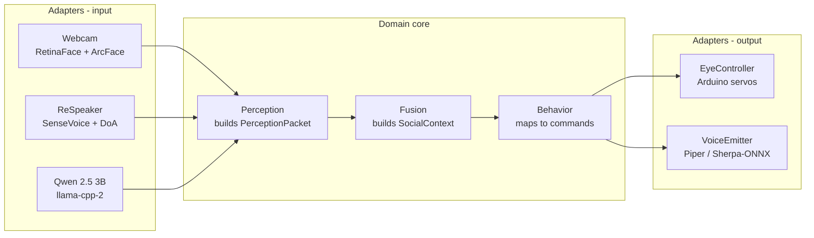

# Architecture

Hexagonal (ports & adapters). Domain core is hardware-agnostic and deterministic. Adapters wrap models and physical devices.

---

## Layers

Each adapter is a Rust module behind a port `trait`. Swapping real hardware for a Godot sim adapter requires no domain changes.

---

## Tick Rates

| Component | Rate | Notes |
|---|---|---|
| Vision adapter | 15 FPS | enough for micro-expression |
| Acoustic adapter | 30 FPS | sliding-window over 16kHz PCM |
| Perception aggregator | 10 Hz | emits `PerceptionPacket` every 100ms |
| Fusion engine | 20 Hz | reads atomic snapshot, emits `SocialContext` |
| Motor command | TBD | gated by 300ms hysteresis |

---

## Threading

- One thread per input adapter (vision, acoustic, semantic). Each writes to an atomic latest-value slot.
- One main core loop runs perception + fusion + behavior at fusion tick rate. Reads slots non-blocking.
- Output adapters run async — motor serial writes batched to Arduino, TTS async via channel.

No locks on the hot path. Atomic snapshots only.

---

## Simulation
Godot project replaces input + output adapters with sim stubs. Domain code is byte-identical between real and sim runs — enables deterministic replay testing.

> Godot scaffold: not yet built. See [roadmap.md](roadmap.md).
